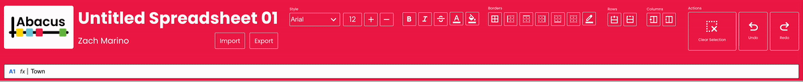

+++
title = 'Abacus'
date = 2024-11-01T17:16:35-04:00
draft = false
toc = true
description = "Spreadsheet application project for CS4530 Fundamentals of Software Engineering"
tags = [
    "react",
    "typescript",
    "figma",
    "UI/UX"
]
categories = [
    "code",
    "design",
    "featured work"
]
image = "Abacus.webp"
+++

Abacus is a spreadsheet application I developed with Trey Olimpo and Oliver Orthwein in my Fundamentals of Software Engineering class. I handled all frontend and API development, while they handled the central spreadsheet logic. Our professor gave us a set of core requirements that we needed to implement, as well as having us develop and implement three additional features.

## Requirements

**We were given the following core requirements for our spreadsheet:**

- The spreadsheet must allow cells to contain numeric constants, string constants, cell
 references, range expressions, and formulas
- The spreadsheet must check for error conditions that may arise and adopt a consistent policy
 for handling these. It is up to you to determine what error conditions may occur!
- The spreadsheet must enable the user to insert a row, insert a column, delete a row, delete
 a column, and clear the contents of a cell. After performing an insert/delete operation,
 formulas should refer to the same cells that they referenced before the operation
- The project must produce a useful web-based user interface that is created using React
- The main logic for your application must be written in TypeScript

**We chose the following three additional features for our spreadsheet:**

- Cell styling: Ability to adjust cosmetic properties of a cell, including making text bold, italics, or strikethrough; Changing the color of the text or cell; and adding borders and different border styles.

- Undo/Redo function: Ability to revert to a previous spreadsheet version and vice versa.

- Import/Export function: Ability to import a CSV file and export a CSV or SQL INSERT file.

## Spreadsheet design

[Link to full file](https://www.figma.com/design/7fK9op1Ncvsx2v1PE3g8RF/Spreadsheet-Application-Prototype?node-id=92-8&t=kt8Sh72wE7GaveoN-1)



Since this was a coding project, we were not asked to do user testing. We weren't even asked to make anything more than a basic wireframe. I took the time to build out a full prototype because while I did lose out on coding time, I felt that doing this would significantly reduce the time it would take to flesh out the layout and style components down the line. This turned out to be true. Prototyping helped me figure out the structure to make the toolbar and formula bar responsive to different screens.

The prototype also helped me flesh out the code structure for my buttons. The structure of creating a generic button component that accepted different SVG icons in Figma was implemented precisely in code and helped abstract a large amount of redundant code. **This exercise in turning prototypes into code reinforces my belief that knowing how to code as a designer can significantly improve the coding experience for developers.**

## Frontend Architecture

We were free to create the frontend whichever way we wanted, so long as it rendered what the backend did. Most other teams decided to re-render their spreadsheet whenever a change occurred but we decided to take a different approach. Since our project had a large emphasis on individual cell customization, we wanted to make sure it was possible to re-render an individual cell when that was the only change. The whole spreadsheet would still need to be re-rendered when cell locations changed, but if the only change was the property of a single cell, then there was no need to re-render everything else.

We implemented this by creating two React contexts, SelectedCellContext and GridContext.

### SelectedCellContext

SelectedCellContext would track the currently selected cell and handle updates. Specifically, I had a function called updateSelectedCellProperty() which would take in a property and a value and pass that into a POST request which would update the property in the backend. updateSelectedCellProperty() would then increment a useState hook called setUpdateTrigger which would trigger the context to fetch the updated cell data via another function. That function would set the cell data in a useState hook and that hook is then passed into the instance of the cell.

```typescript
// SelectedCellContext.tsx

// Update specific properties of the selected cell
const updateSelectedCellProperty = async (
  property: string,
  value: string | number | boolean
): Promise<void> => {
  try {
    const { col, row } = selectedCell;
    const response = await fetch(
      `/api/cells/update/${property}/${col}/${row}`,
 {
        method: "POST",
        headers: { "Content-Type": "application/json" },
        body: JSON.stringify({ value }),
 }
 );

    setUpdateTrigger((prev) => prev + 1); // Trigger a re-fetch of the selected cell

    fetchCellData(); // Re-fetch the cell data to reflect the change
    console.log(
      `Property ${property} of cell (${col}, ${row}) updated to ${value}.`
 );
 } catch (error) {
    console.error(
      `Error updating property ${property} of selected cell:`,
      error
 );
 }
};
```

### GridContext

Entire spreadsheet re-rendering is actually handled in the spreadsheet component itself using useMemo hooks, but we needed a way to track when to re-render. This was especially the case when the amount of rows and columns would change. GridContext would track this and GridDataProvider would support it too. The custom hook below would handle the initial render of rows and columns.

```typescript
// GridDataProvider.tsx
useEffect(() => {
  const initializeGridDimensions = async () => {
    try {
      // Fetch all cell data
      const response = await fetch("/api/cells");
      if (!response.ok) {
        throw new Error("Failed to fetch cell data");
 }

      const cellData = await response.json();

      // Find the maximum column and row indices
      let maxCol = 0;
      let maxRow = 0;

      cellData.forEach((cell: { col: number; row: number }) => {
        maxCol = Math.max(maxCol, cell.col);
        maxRow = Math.max(maxRow, cell.row);
 });

      // Add some padding to the maximum dimensions
      const paddingCells = 3;
      setColumns(Math.max(maxCol + paddingCells, 5)); // Minimum of 5 columns
      setRows(Math.max(maxRow + paddingCells, 10)); // Minimum of 10 rows
 } catch (error) {
      console.error("Error initializing grid dimensions:", error);
      // Fall back to default dimensions
      setColumns(5);
      setRows(10);
 }
 };

  initializeGridDimensions();
}, [setColumns, setRows]);
```

## Layout

As mentioned earlier, I used Figma to prototype the responsiveness of our prototype, specifically making the toolbar and formula bar responsive. I structured the toolbar in a way that mimicked how it would be done using HTML and flexboxes. At larger sizes, the toolbar is one long line but as the page gets smaller, it becomes two. Making the screen size any smaller would make the toolbar three lines which was not very user-friendly so I set a minimum width for the toolbar.




To position the header above the actual spreadsheet, I created a split-screen layout component that structured the page using flexboxes. Besides being the easiest approach, I did this with a dedicated layout component because it is best practice to have position logic separated from component logic to retain the reusable nature of components.

App.tsx was the main entry point for the frontend and contained the calls to the primary contexts and layout components.

```typescript
// App.tsx
function App() {
  return (
 <GridProvider initialColumns={5} initialRows={10}>
 <GridDataProvider>
 <SelectedCellProvider>
 <SplitScreen 
            child1={<Header />} 
            child2={<Spreadsheet />} />
 </SelectedCellProvider>
 </GridDataProvider>
 </GridProvider>
 );
}

export default App;
```

## API

Our API was a pretty straightforward Express router setup. My partners created public-facing methods to access the Spreadsheet Model and the API calls those getter and setter methods. This separation between the backend and frontend lets us sanitize inputs and outputs, preventing errors in the backend or frontend from affecting each other. updateSelectedCellProperty() (from SelectedCellContext) would send POST requests to a large route that had a switch case for each possible cell property.

```typescript
// POST: Update a cell's property
router.post('/api/cells/update/:property/:col/:row', (req: Request, res: Response) => {
  const { property, col, row } = req.params;
  const { value } = req.body; // Use `value` instead of `body` for clarity

  const colIndex = parseInt(col, 10);
  const rowIndex = parseInt(row, 10);

  try {
    switch (property) {
      case 'content':
        ExampleSpreadsheet.setCellContent(colIndex, rowIndex, value);
        res.status(200).json({ message: `Cell content updated to ${value} successfully!` });
        break;

      case 'bold':
        ExampleSpreadsheet.toggleCellBold(colIndex, rowIndex);
        res.status(200).json({ message: `Cell (${col}, ${row}) updated to bold.` });
        break;

      case 'italic':
        ExampleSpreadsheet.toggleCellItalic(colIndex, rowIndex);
        res.status(200).json({ message: `Cell (${col}, ${row}) updated to italic.` });
        break;

      case 'strikethrough':
        ExampleSpreadsheet.toggleCellStrikethrough(colIndex, rowIndex);
        res.status(200).json({ message: `Cell (${col}, ${row}) updated to strikethrough.` });

      case 'font':
        ExampleSpreadsheet.setCellFont(colIndex, rowIndex, value);
        res.status(200).json({ message: `Cell (${col}, ${row}) font updated to ${value}.` });
        break;

      case 'fontSize':
        ExampleSpreadsheet.setCellFontSize(colIndex, rowIndex, value);
        res.status(200).json({ message: `Cell (${col}, ${row}) font size updated to ${value}.` });
        break;

      case 'fontColor':
        const fontColorNumber = parseInt(value.slice(1), 16); // Convert hex string to number
        ExampleSpreadsheet.setCellFontColor(colIndex, rowIndex, fontColorNumber);
        res.status(200).json({ message: `Cell (${col}, ${row}) font color updated to ${fontColorNumber}.` });
        break;

      case 'cellColor':
        const colorNumber = parseInt(value.slice(1), 16); // Convert hex string to number
        ExampleSpreadsheet.setCellColor(colIndex, rowIndex, colorNumber);
        res.status(200).json({ message: `Cell (${col}, ${row}) color updated to ${colorNumber}.` });
        break;

      default:
        res.status(400).json({ error: `Invalid property: ${property}` });
 }
 } catch (error) {
    console.error(`Error updating ${property} for cell (${col}, ${row}):`, error);
    res.status(500).json({ error: `Failed to update ${property} for cell (${col}, ${row}).` });
 }
});
```

## Challenges & Lessons Learned

Before starting this project, my knowledge of React ended with component creation and styling. I could make and style components quickly but I was completely lost in adding any functionality. This project gave me a crash course in hooks, contexts, states, and even creating overlays. Since React was not a focus of the class besides basic interactions, I had to teach myself all of these new concepts.

I think the quality of my code could certainly be improved. SelectedCellContext works fine for handling individual cells, but re-rendering the entire spreadsheet when cell locations changed was a bit sloppy. As well, clicking on a cell fetches that cell's data twice as it's used multiple times. If I had more time on this project, I probably could have consolidated these calls. The data we send and receive is already lower than other groups due to how we refresh individual cells but doubling the amount of calls would add up with larger spreadsheets. Despite these shortcomings, I'm proud of how far I got using a previously unfamiliar system.