+++
title = 'Pitch - CAMD Directed Study'
date = 2024-12-01T17:16:35-04:00
draft = false
toc = true
description = "Idea generation card deck for journalists"
tags = [
    "adobe suite",
    "graphic design",
    "figma",
    "UI/UX"
]
categories = [
    "design",
    "featured work"
]
+++

## Introduction

Pitch is a design kit that provides journalists with a more structured avenue for brainstorming story ideas. I created this card deck for my CAMD directed study to answer the question of what it means to think like a designer.

**Details about specific stages can be found in the presentation deck below**

## Presentation Deck
[Link to Presentation](https://www.figma.com/deck/H1QxQ68WMjtA6wrn0egYWp/Pitch-Project-Presentation?node-id=1-587&t=hQcllipM7sx6iXAP-1)


## Part 1: User Research (Slide 2)

### User Interviews (Slide 3)

I officially interviewed four people for this project: [Katrina Liu](https://www.linkedin.com/in/katrina-liu-1311a218b/), [Eli Cloutier](https://www.linkedin.com/in/eli-cloutier-7249a6264/), [Brian McGrory](https://www.bostonglobe.com/about/staff-list/columnist/brian-mcgrory/), and [Emily Turner](https://www.linkedin.com/in/turneremily/). Katrina and Eli are new reporters while Brian and Emily are editors. Unofficially, I discussed ideas with [Emily Wyrwa](https://www.linkedin.com/in/emily-wyrwa220/) (a future user tester) and I used the knowledge I gained as a product management co-op at the Boston Globe to support my research. I collated my interviews into three primary takeaways:

1. There is a “sixth sense” for finding a good pitch. Finding a good pitch is an art, not a science, but it can still be trained.
2. There is no longer an appetite for record-only journalism in the media industry.
3. Innovation is needed in this traditional industry to become “relentlessly interesting.”

I also gleaned a set of 12 pain points from my interviews that would influence future ideas for the project.

### Journey Map (Slides 11)

With my takeaways and data from my user interviews, I combined that information with the journalistic process I observed at the Boston Globe to develop a Journey Map for the journalistic process. This journey map details each stage of the process from Ideation to publication, as well as what success looks like at each stage. This map helped me document the different stages of the process and where/what my solution could address. 

## Part 2: Contextual Research (Slide 19)

### What is a design kit? (Slide 20)

Before I could develop my solution, I first had to determine what a design kit was in the first place I looked at three existing design kits to get a better idea:

1. [Storytelling Deck by triggers](https://www.trytriggers.com/shop-triggers-tools/p/storytelling-deck)
2. [DIY Toolkit by Nesta, STBY, Quicksand](https://www.nesta.org.uk/toolkit/diy-toolkit/)
3. [Beautiful Trouble by Beautiful Trouble](https://beautifultrouble.org/)

I identified some characteristics of each design kit that I could incorporate into my project, as well as general qualities that made the design kit function. I collated all of this research into the following definition:

> A design kit is a collection of exercises, templates, and case studies to facilitate some kind of design process. That process is dictated by the subject matter of the design kit and can focus on a specific aspect of design or be a full walkthrough of the process. **The goal of a design kit is to break up a large project into smaller, more focused chunks to arrive at a more quality solution.**

I specifically conducted a **comparative analysis (Slide 24)** on Beautiful Trouble to determine how they categorize and style their cards. I used Nielson's 10 usability heuristics to better understand what made the cards work. I noted their use of color and iconography to determine category, and their use of a QR code to reduce the complexity of the card.

## Part 3: Ideation and Refinement (Slide 26)

### "How Might We" Statements and Ideas (Slide 27)
With all of this research and the pain points I gathered from my user interviews, I put it all together to create some "How Might We" Statements. I wrote six and ended up focusing on three:

1. How might we help journalists brainstorm story ideas?
2. How might we identify the variables required for an engaging story?
3. How might we provide journalists with a toolkit for idea gathering?

My project ultimately followed the third HMW statement but at the time of creating these statements, I brainstormed four potential ideas:

1. (HMW 1) Brainstorming cards. Can either be a set of cards that guide what to look for in a story or different prompts that encourage brainstorming
2. (HMW 2) Data visualization of what articles are doing well via various metrics that can be tracked
3. (HMW 2) Making the already available data more accessible to journalists through a template-esque solution (with support from backend newsroom staff)
4. (HMW 3) An application that stores different resources, like links to social media, local newsletters, government data, etc.

### Storyboard (Slide 29)

The idea that seemed the most feasible based on my research and a discussion with a journalist friend was the brainstorming cards so I pushed forward and developed a storyboard. The storyboard features a user who is given a pitch by their editor and uses the cards to support the development of the story she is writing. This storyboard featured cards with content that extended past idea generation because it seemed doable at the time but user testing would determine this to not be as feasible as previously thought.

## Part 4: Prototype (Slide 30)

### Paper Prototype (Slide 31)

I tested my paper prototype with Emily Wyrwa and the initial results were promising. We were able to develop a potential pitch in 17 minutes using the cards (as opposed to a usual time of what can be several hours). The potential pitch she developed was accepted by her editor but the subject of the idea unfortunately did not respond to an interview request. As mentioned earlier, at this point in the project I had cards with content that extended past idea generation. This prototype had a category for each step of the journalistic process but we determined that taking on every step of the process proved to be too wide of a net. Focusing on idea generation would make for a more focused design kit.

### Mental Model (Slide 32)

Now that I was focusing on just idea generation, I needed to flesh out how I would categorize the cards. Using my comparative analysis and observations from my user testing I developed the following mental model:

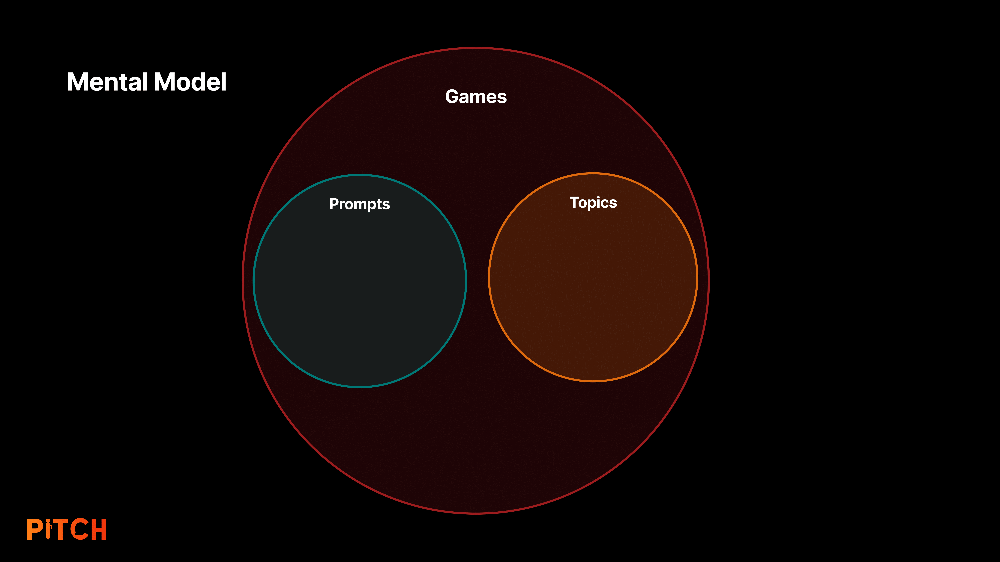

Game cards are essentially larger activities that can incorporate prompt and topic cards. Prompt cards are guided questions to kick off idea generation, and topic cards are evergreen topics that can serve as inspiration for new stories and styles.

### Low-Fidelity Prototype (Slide 33)

My first prototype was in color to simulate the categories but overall, it was very simple. I printed them out on paper and then glued the sides to cardstock to give them more weight. The initial name idea I had was "Heartlines" which was a play on Headlines and the "heart" of human interest stories. It was a clever name on paper but sounded medical so it was scrapped. 

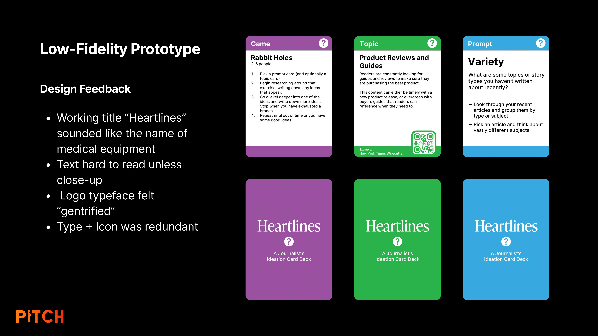

### User Testing (Slide 35)

The card design was subject to change but the content of the cards was a separate entity that could be tested. I held a user testing session with [Emily Wyrwa](https://www.linkedin.com/in/emily-wyrwa220/), [Daisy Levine](https://www.linkedin.com/in/daisylevine/), and [Luke Scotchie](https://www.linkedin.com/in/luke-scotchie/) to determine if the card content was successful as the initial paper prototype was. I noted down their words, actions, and body language to determine how they were interacting with my card deck. I also tracked quantitative measures like the time it took to develop a viable pitch to get hard statistics on the efficacy of my solution.

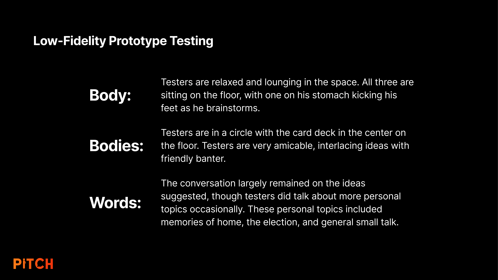
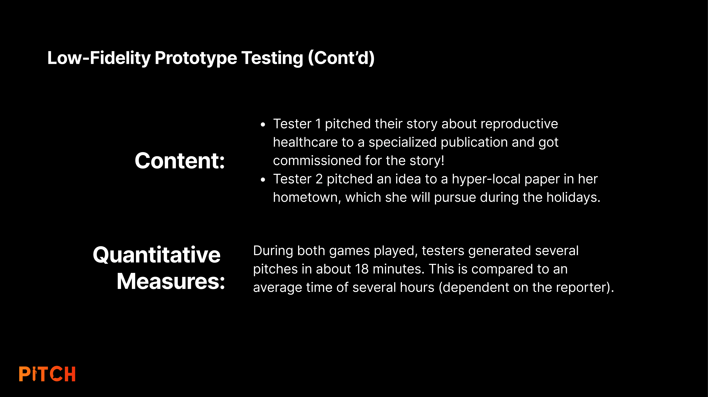

As I was putting the final pieces together for this project, I was given updates on the pitches they developed during the session. Tester 1 is actively researching and interviewing for their reproductive health story, and Tester 2 is doing the same with theirs. Tester 1 also adapted an idea Tester 3 had [into an article that was recently published in the Boston Globe.](https://www.bostonglobe.com/2024/12/20/arts/sweet-spot-boston-public-art-triennial-accelerator/)

### Moodboards (Slide 38)

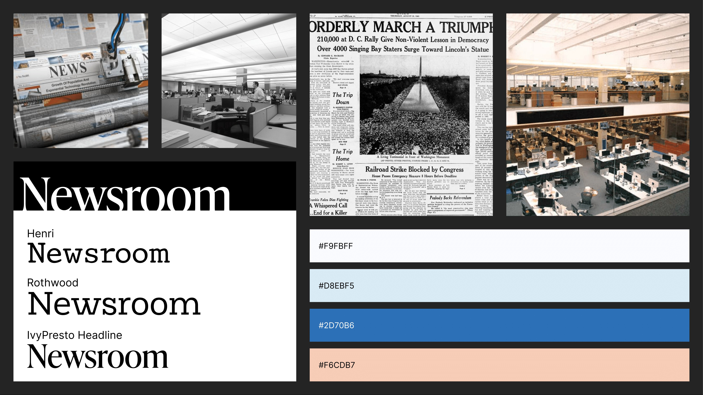
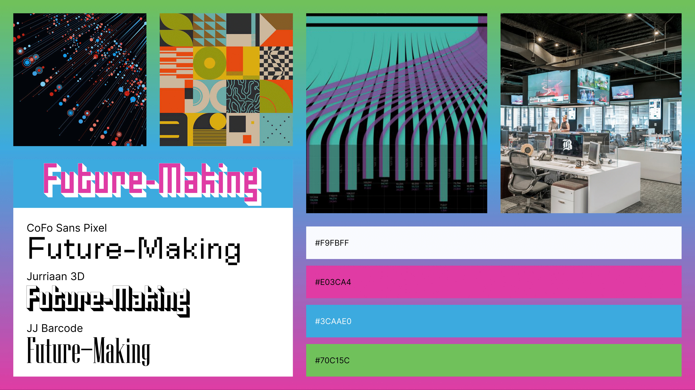

After user testing, I created two mood boards to ideate on the aesthetics and vibe I wanted the visual design of my card deck to have. The first mood board was focused around the classic Newsroom vibe, with the rigid black and white structure of a print newspaper and the official and serious feeling of a large newsroom.

My second mood board was focused on innovation, big data, and abstract shapes. I named this "future-making". This mood board was purposely very out there and fun to serve as a juxtaposition to the first mood board. The style I would eventually end up with is a mixture of both.

### Medium-Fidelity Prototype (Slide 40)

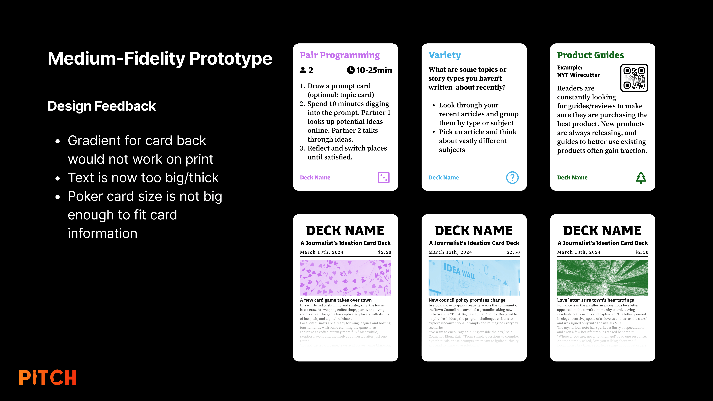

My medium-fidelity prototype was an improvement over my first prototype but still needed a lot of work. I liked the structure of information on the front side of the cards but I was having trouble with how I wanted the back side to look. I tried to mimic the look of a newspaper but it was too busy to see at a glance if it was the front or back of the card.

### Logo Design (Slide 41)

I began prototyping the name and logo by rapidly identifying different concepts and objects related to journalism, ideation, and sources. I would then pick an interesting word or concept and go further in that direction to identify potential names. This is a similar approach to the "Rabbit Holes" card in my card deck. The three potential names I conceived during this brainstorming session were Roladeck, Sources, and Pitch Deck. Of the three, I went with Pitch Deck.

I started sketching out some potential logos that would be placed on the backside of a card. I showed these sketches to my roommates who liked the third idea. We decided it would look and sound better as just "Pitch" so we dropped the "Deck". Saying "Pitch Deck" was implied anyway as Pitch is a card deck. I traced out a cleaner version of the logo and traced it digitally in Adobe Illustrator.

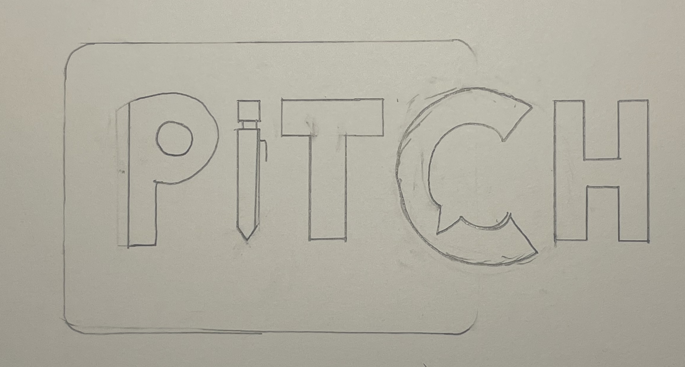

The final logo features a pen to represent the tool and job of a journalist, and the speech bubble represents the conversational nature of pitching an idea, as pitching an idea to your editor and vice versa is typically just a conversation. 

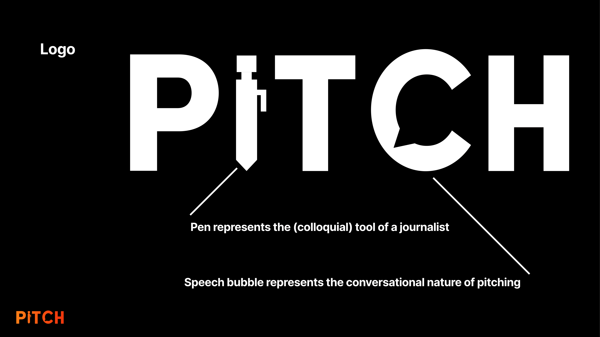

### Final Prototype/Website

I determined from my user testing that the card content was successful, but there was still work to be done. The card content needed to be more clear and concise to fit the instructions on a single card without sacrificing comprehension of the instructions. I also realized that the size of a QR code scales with the amount of text so the example QR code I was using was much smaller than my actual QR codes would be. My solution was to both make the cards more concise but also increase the size of the cards. I switched from poker-sized cards to tarot-sized cards. I picked tarot size because it was big enough to fit the content without being so big that they were hard to use as cards. I improved the information structure of the medium fidelity prototype and ditched the icons as they felt tacky compared to just text and color. I replaced the back side of the card with a solid color and the logo. I also created an instruction and credit card.

The cards are a physical product but the easiest way to get my card deck to other people for use is digitally. I created a companion website to house all of the cards so that any journalist can use it for free. I coded the website using React and Typescript, deploying via Vite and Vercel. This website was beyond the scope of the project but something I wanted to work on myself to improve my coding skills. [Click here to see the website.](https://pitchjourno.com)

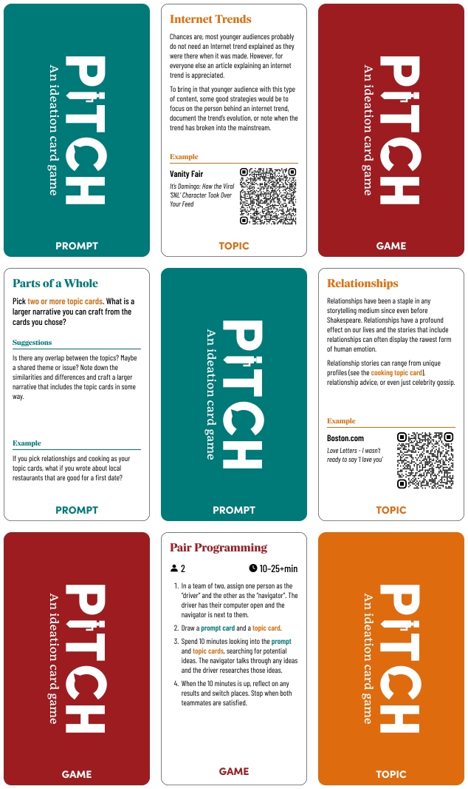

## Part 5: Reflection (Slide 44)

### Impact

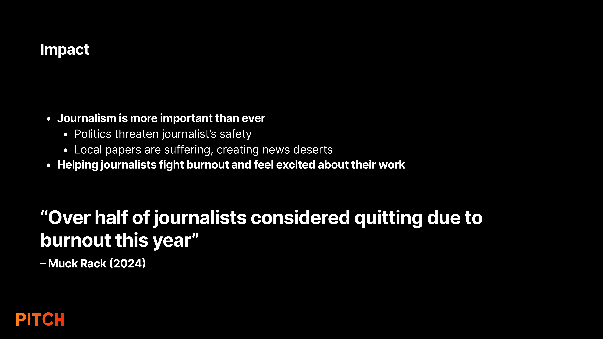

### What does it mean to think like a designer?

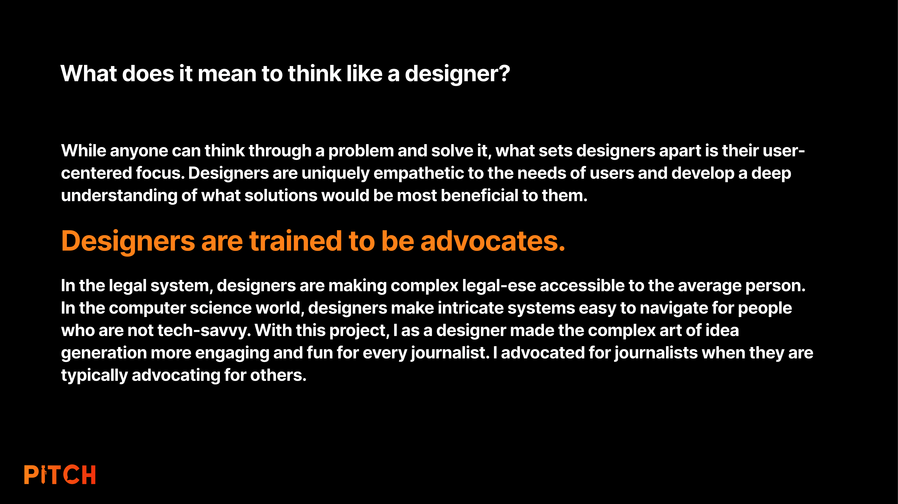