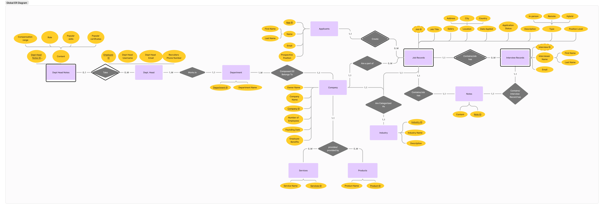
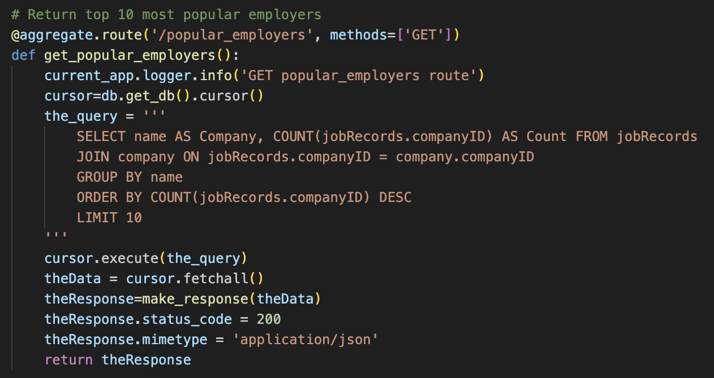
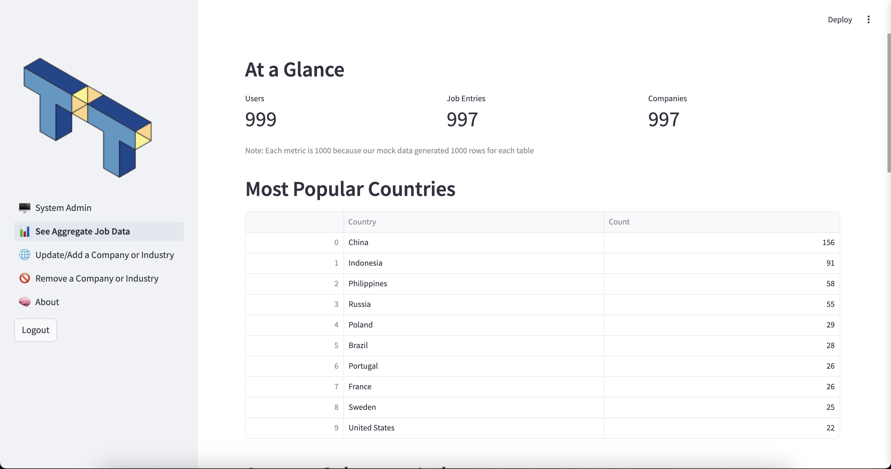
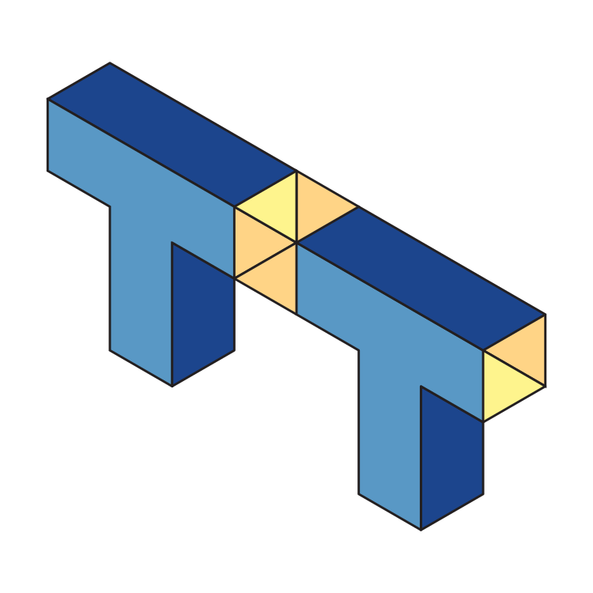

+++
title = 'TalentTrace'
date = 2024-08-15T17:16:35-04:00
draft = false
toc = true
description = "Job tracker and aggregate data app for CS3200"
tags = [
    "mySQL",
    "flask",
    "streamlit",
    "graphic design"

]
categories = [
    "code",
    "featured work"
]
image = "TalentTrace.png"
+++

## Introduction

TalentTrace is a job tracker and aggregate job data app that my group and I created for our final project in CS3200 Database Design. Users can add jobs entries to TalentTrace and see all of their applications at a glance. They can also see aggregate data from all job entries to see and analyze market trends. Recruiters can use TalentTrace to keep track of applicants and any interviews they have with them. The project repository can be found on my github or by clicking the button below.



## Tech Stack

Our tech stack consists of MySQL for the database, Flask for the backend, and Streamlit for the frontend. This stack was provided to us in a template created by our professor that we forked. Each tier was containerized using docker. While DevOps was not the focus of this project, since finishing this project I have investigated and learned how to setup a similar tech stack and containerize every tier.

### Database

Our database is coded in MySQL and contains a DDL file as well as several files housing mock data generated by [Mockaroo](https://www.mockaroo.com/). Before coding the database files, we first did a very basic design iteration and identified our users and their needs. We then took those needs and translated them into a large Entity-Relationship diagram.



With the diagram ready to go, we translated it into a DDL file which was set to run every time the MySQL docker container was spun up using ```docker compose up db```

### Backend API

We built our API using Flask. Our professor provided the template for the project so all setup was done for us, we just needed to create routes and blueprints to connect the database to the frontend. We created a blueprint for each entity that required a route like job entries, users, etc. We also had a route for all of our aggregate queries. An alternative method to connect the database to the frontend would have been to create a couple of large routes and running any specific queries in the frontend using pandas but that would have bad practice. It is better to keep the database and frontend as separate as possible, and it was easier to just create extra routes or abstract already made routes.



### Frontend

Our frontend was built with Streamlit, a data visualization tool written in python. Streamlit was not built to run an application like our project, but the focus of the class was not on front-end development and Streamlit was easy to pick up as everything is prebuilt. We mocked user authentication using buttons and session states and created flows for each persona. Each persona needed to have a GET, PUT, POST, and DELETE route. Our project was not graded on UX or visual design, but considering my skillset, I wanted to add some design elements to make sure our app felt good to use despite the limited framework. We added confirmation messages to any forms, downloaded more advanced data viz frameworks to better display the data, and I created a logo to add an extra touch of cohesiveness to our project.



## Logo



I didn't want to spend too much time with the logo as it did not impact our grade but I still wanted to make something interesting (or at least better than the AI generated logos other teams were using). The "trace" in TalentTrace reminded me of a light/spotlight which is represented by the yellow streak that runs through the two T's. The blue was chosen because it complemented well with the yellow when I was picking colors. The geometric look was used because we felt it looked professional without being generic. 

## Conclusion

Prior to this class, my last computer science class was Algorithms which really killed a lot of my interest in computer science. This project brought my enthusiasm back. It was incredibly fun learning how to bring all of these different parts of software engineering together into a cohesive product. I feel like I finally see the full picture in regards to what I've been learning and it also made me realize I don't want to do *just* design or computer science, I want to do both. I still find backend development (specifically algorithms) intimidating but I didn't expect to enjoy databases as much as I did. 